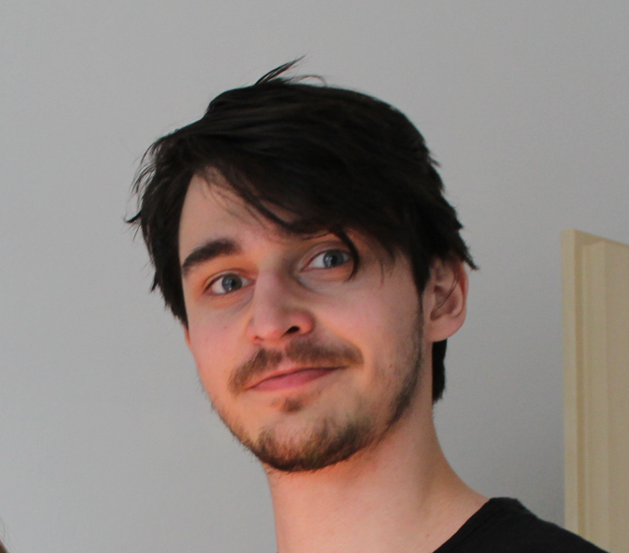

    

# Jakub Jíra
 

    <a href="jakub.jira@protonmail.com">jakub.jira@protonmail.com</a>
|   <a href="https://github.com/japawBlob">github.com/japawBlob</a>
|    <a href="https://www.linkedin.com/in/jakub-j%C3%ADra/">linkedin.com/in/jakub-jíra</a>

## Personal Information

### Contact

Tel: +420 775 602 272

Email: jakub.jira@protonmail.com

Adress: U Vodojemu 625, Chrast

### Other

Born: 8. 11. 1998 in Chrudim

Citizenship: Czech Republic

Sex: Male

## Education

### School

`2021-2024`
Open informatics - Computer engineering, Czech Technical University in Prague
- Diploma thesis topic: Diagnostic tools for automotive ECUs
- Created one private and two public libraries: [tokio-socketcan-isotp](https://crates.io/crates/tokio-socketcan-isotp), [uds-rs](https://crates.io/crates/uds-rs)
- Final grade: B

`2018-2021`
Open informatics - Internet of things, Czech Technical University in Prague
- Bachelor thesis topic: Intelligent Pills Dispenser Design

`2014-2018`
Gymnázium, Pardubice, Dašická 1084

### Other

`2016-2018`
Microsoft Student Trainee Center
- Graduate with honours

## Working Experience

### Employment

`2024-present`
Full-time - Application engineer at STMicroelectronics
- Microcontroller user support for large customers 
- Creating demo applications: DC-DC convertor with StellarE 
- Studied DFA (Data flow architecture) hardware accelerator and hosted knowleadge sharing session for the microcontroller team
- Schematic review

`2023-2024`
Part-time - Trainee at STMicroelectronics
- Creating demo applications for StellarE microcontroller with the focus on high resolution timers

### Freelance

`2021-2023`
Full-time - Network Admin at RIXO.cz
- Managing Microsoft Azure, Salesforce Service Cloud
- Scripting in python and PowerShell, deploying programs and policies on 200+ Windows devices
- User support for internal systems

`2015-present`
Part-time - Network Admin at Firma OKO
- Family business
- Repairing camera servers, device management, installation of camera systems

### Volunteering

`2018-2022`
Microsoft Student Trainee Center
- Participant in worldwide Microsoft Hackathon - OneWeek
- Former leadership member
- Advisor on IoT projects
- Lecturer of programming, networking and soft skills

## Certifications

`2024`
Open Source Software Development, Linux and Git

`2020`
Cisco Certified Network Associate Routing and Switching (CCNA)

`2019`
Microsoft Technology Associate: Windows Operating System Fundamentals (MTA)

`2016`
MOS: Microsoft Office PowerPoint 2013

## Languages

Czech - native

English - working proficiency

Russian - beginner

## Computer Skills

Programming Languages:
- Comfortable working with and using on regular basis: C, Rust, Python, GnuMake, Bash
- Have some experience with: C++, Java, PowerShell, Meson, Nix language, Lua (NeoVim)

Technologies & Software:
- Avid GNU/Linux power-user
- Embedded bare-metal programming
- Hardware debugging (Lauterbach, UDE)
- Git, Jira, Confluence 

## Interests

Japanese material arts - Battōjutsu

3D printing

### Last updated: 

August 2024