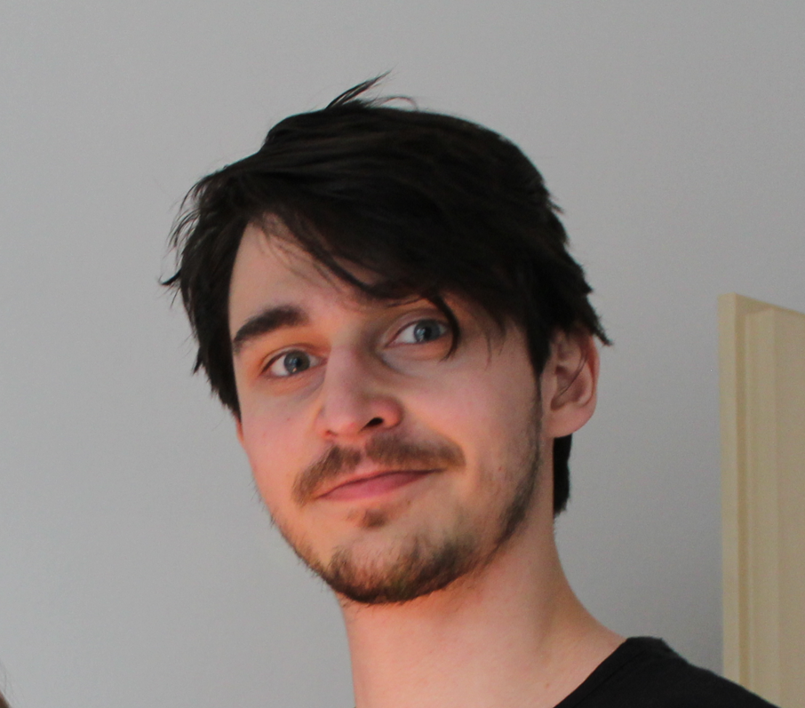

    

# Jakub Jíra

    <a href="jakub.jira@protonmail.com">jakub.jira@protonmail.com</a>
|   <a href="https://github.com/japawBlob">github.com/japawBlob</a>
|    <a href="https://www.linkedin.com/in/jakub-j%C3%ADra/">linkedin.com/in/jakub-jíra</a>

## Personal Information

Prague, Czech Republic

Tel: +420 775 602 272

Email: jakub.jira@protonmail.com

## Summary

Computer engineer with experience in LLM inference, low-level programming and Rust development. Currently leading an engineering team of 8 people, delivering infrastructure, DevOps, and telemetry solutions. Background in microcontroller applications, automotive tooling, and distributed systems.

## Education

### School

`2021-2024`
Open informatics - Computer engineering, Czech Technical University in Prague
- Diploma thesis topic: Diagnostic tools for automotive ECUs
- Developing automotive tools using Rust - created one private and two public libraries: [tokio-socketcan-isotp](https://crates.io/crates/tokio-socketcan-isotp), [uds-rs](https://crates.io/crates/uds-rs)
- Final grade: B

`2018-2021`
Open informatics - Internet of things, Czech Technical University in Prague
- Bachelor thesis topic: Intelligent Pills Dispenser Design

`2014-2018`
Gymnázium, Pardubice, Dašická 1084

### Other

`2016-2018`
Microsoft Student Trainee Center
- Graduate with honours

## Working Experience

### Employment

`2025-present`
Team leader Software engineer at Turbonext.ai
- Led two engineering teams (4-person delivery -> 8-person infrastructure).
- Responsibilities range from DevOps (Github actions), Telemetry (Prometheus, Grafana, OTEL), testing and validation
- Collaborating with teams across Taiwan, India, USA; participated in onsite client meetings in China
- Coordinating cross-team projects.

`2024-2025`
Software engineer at Turbonext.ai
- Worked on implementing some data plane features to custom fork of vLLM
- Led development of a demo that resulted in 6/6 positive meetings with potential investors and customers.

`2023-2024`
Application engineer at STMicroelectronics
- Microcontroller user support for large customers
- Creating demo applications for StellarE microcontroller with the focus on high resolution timers
- Creating demo applications: DC-DC converter with StellarE
- Studied DFA (Data flow architecture) hardware accelerator and hosted knowledge sharing session for the microcontroller team
- Schematic review

### Freelance

`2021-2023`
Network Admin at RIXO.cz
- Managing Microsoft Azure, Salesforce Service Cloud
- Scripting in python and PowerShell, deploying software and policies on 200+ Windows devices
- User support for internal systems

### Volunteering

`2018-2022`
Microsoft Student Trainee Center
- Participant in worldwide Microsoft Hackathon - OneWeek
- Former leadership member
- Advisor on IoT projects
- Lecturer of programming, networking and soft skills

## Certifications

`2024`
Open Source Software Development, Linux and Git

`2020`
Cisco Certified Network Associate Routing and Switching (CCNA)

`2019`
Microsoft Technology Associate: Windows Operating System Fundamentals (MTA)

`2016`
MOS: Microsoft Office PowerPoint 2013

## Languages

Czech - native

English - working proficiency

Russian - beginner

## Skills

### Programming languages:
- C, Python, Rust, GnuMake, Bash, C++, Java, PowerShell, Meson, Nix language, Lua (NeoVim)

### Technologies:

Linux, Docker, GitHub Actions, Prometheus, Grafana, OTEL, Git, CI/CD

### Embedded/Hardware

Bare-metal development, microcontrollers, hardware debugging (Lauterbach, UDE), schematic review

## Interests

Avid Linux user (every personal PC in my home is Linux powered)

PC Gaming

3D printing

### Last updated:

November 2025
